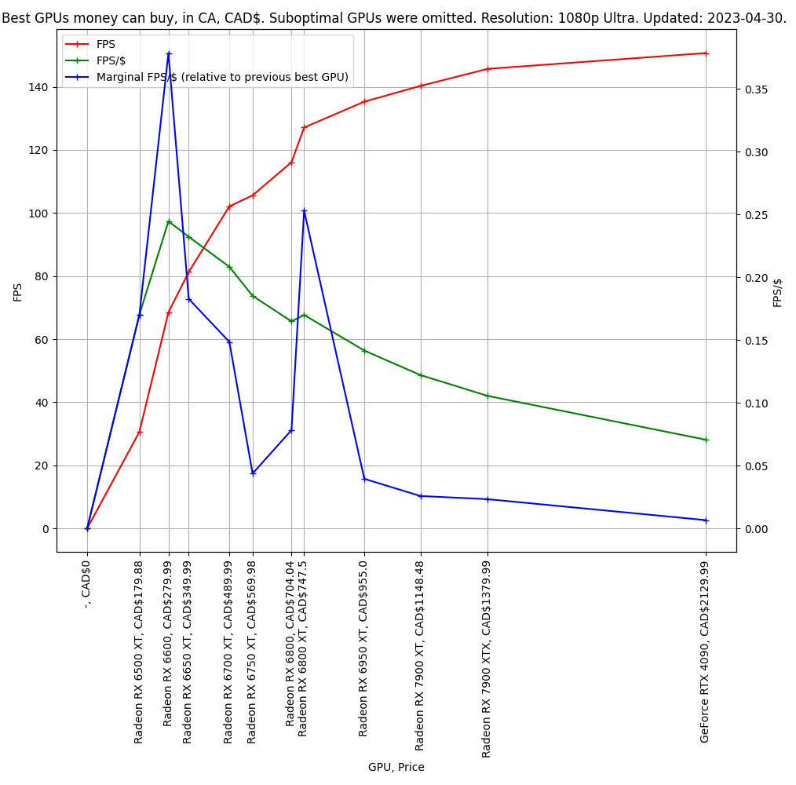
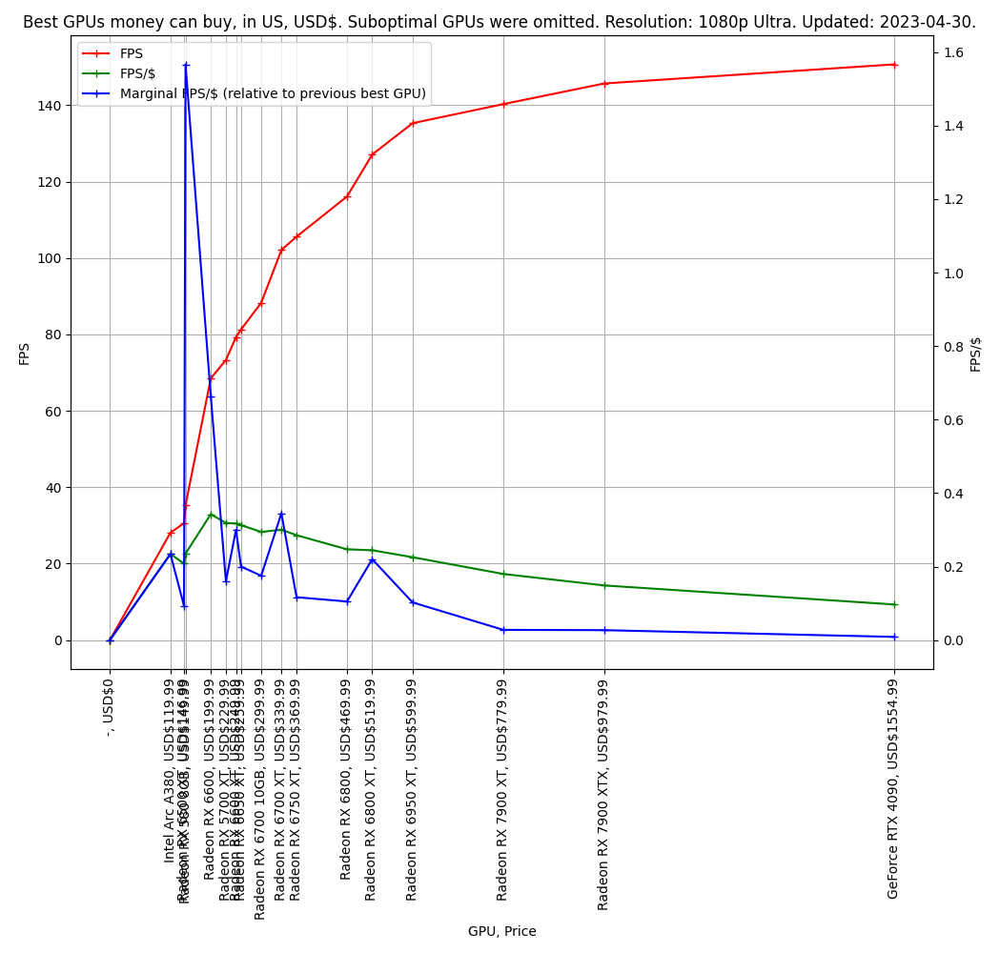
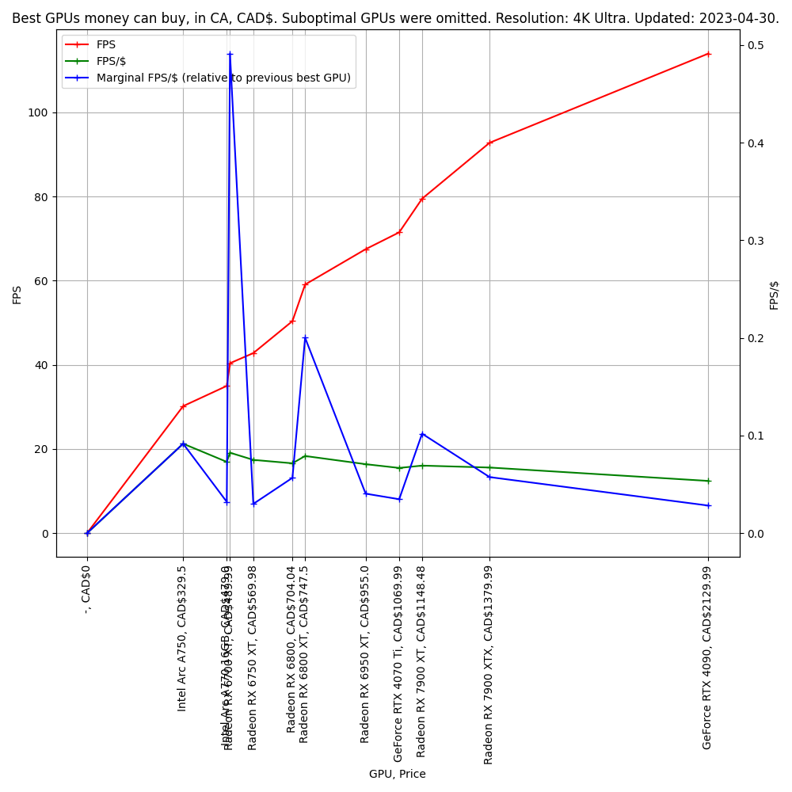
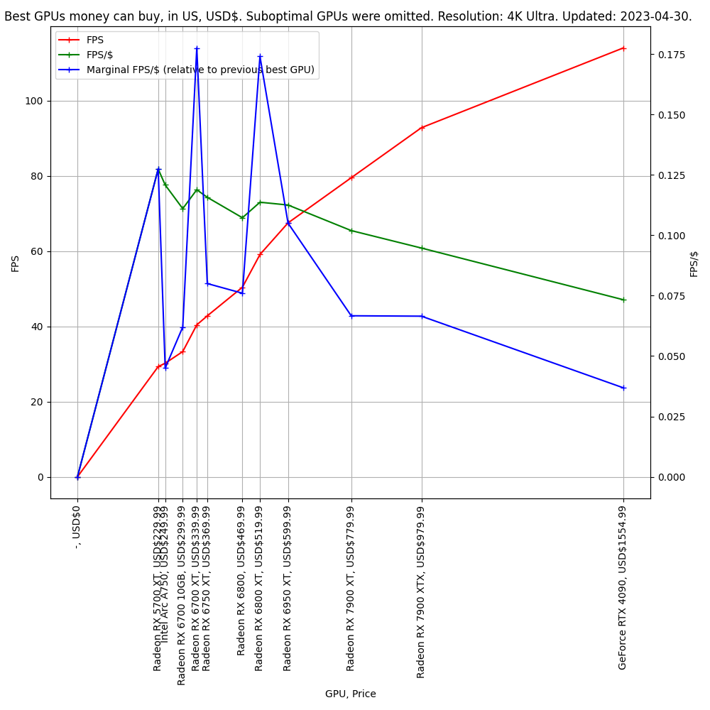
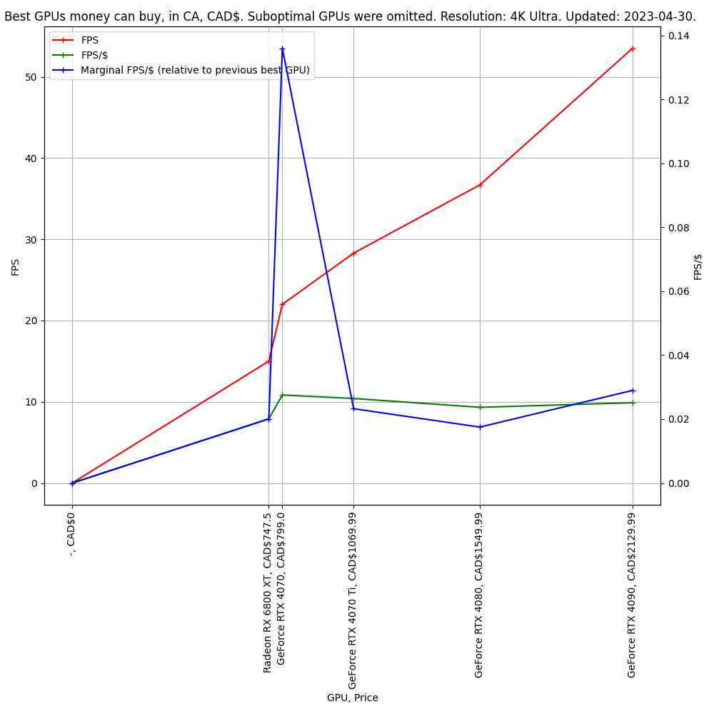

# gpus_comparator

This is a simple tool to visually compare performance of different GPUs.

Quickly discards GPUs that offer a non-competitive performance for price.

Algorithm is based on assumption that if price is increasing from GPU to GPU, then naturally FPS must increase. If FPS stays the same or decreases, then such GPU is a poor choice, so it is automatically discarded.

Uses data from [tomshardware.com](https://www.tomshardware.com/) and [pcpartpicker.com](https://pcpartpicker.com/)

Uses modified version of pypartpicker parser from here: https://github.com/thefakequake/pypartpicker

# Screenshots:

## No raytracing:

## Raytracing:

