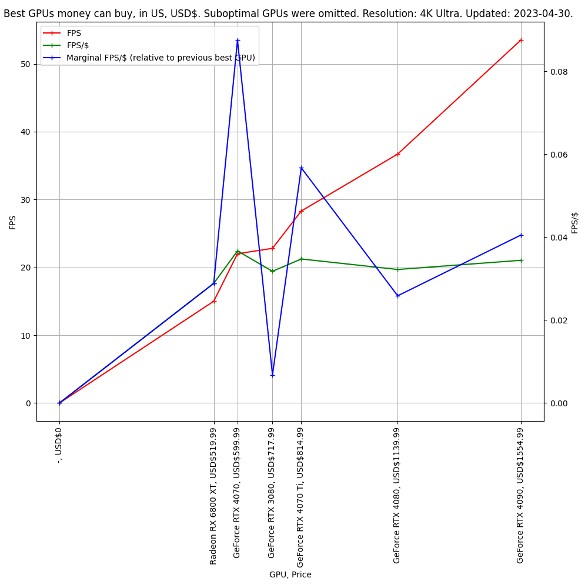

# gpus_comparator

This is a simple tool to visually compare performance of different GPUs.

Quickly discards GPUs that offer a non-competitive performance for price.

Uses data from [tomshardware.com](https://www.tomshardware.com/) and [pcpartpicker.com](https://pcpartpicker.com/)

Uses modified version of pypartpicker parser from here: https://github.com/thefakequake/pypartpicker

Warning: [tomshardware.com](https://www.tomshardware.com/) website may return different values when connected to Wi-Fi
vs on mobile data.
It is probably related to ISP caching.

# Screenshots:

## No raytracing:

## Raytracing:

